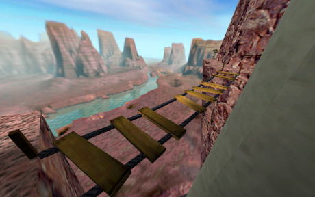
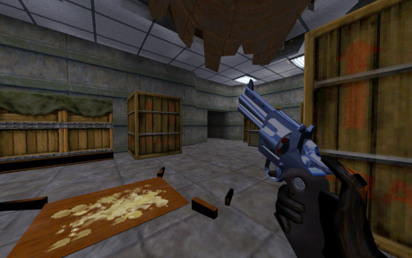

# HALF-LIFE 1
###### WHAT HAS SCIENCE DONE?!
#### [Back...](../../index.md)
# Background
###### GO READ RAISING THE BAR

Ground zero for the modern concept of an FPS. This game made tremendous waves, and shook the entire industry. There were a lot of reasons for this, and it certainly didn't come out of nowhere. This was *the* game to see and play from the moment it was announced all the way up to its release. Game of the Year, and for many, the Game of All Time. This game scarcely needs an introduction, but for the purposes of this website, of course we shall do the best that we can.

Now, there's a lot of additional context that deserves talking about, about this game's history as Prospero, or Quiver, and its many design phases, but as much as I want to dive into each game's development, I'm not a professional (yet) and I'd like to eventually get to a point where writing one of these reviews doesn't take me longer than the week between playing new ones, I'm also sure I just won't have much to say about certain games based on what I can dig up! Nonetheless...

Today, we know Valve as the owners of Steam. Everyone, *everyone* knows Steam, if not Valve. Whether they are one of the many consumers, or some that revile its near-monopoly on PC gaming (outside of others like EA, Ubisoft, GOG, Epic, et cetera.), it is nonetheless a household name among PC gamers. But stepping back to 1996, it was founded, nominally, by two ex-employees of Microsoft. Gabe Newell, and Mike Harrington. I would say 'their stories aren't important to this', but, well, they are!

Quite a bit, in fact!

Gabe, you see, in his long-time service of Microsoft, was among the staff that developed Doom95. This is an immensely important part of the context that makes HL1 what it is. 'Horror' is an interesting word, one which seems to evolve over time both to individuals as well as to us as a society. Most people would not look at Doom, today, and think 'Horror.' But at the time of its release, it was, indeed, quite spooky. Very atmospheric and, importantly, **extremely immersive**. This will come up a lot.

<pic> 
 
</pic>
<pic>In fact, they stole E1M1 almost shot for shot.</pic>

Immersion and horror go hand in hand. Gabe saw the success of Doom--success even in excess of Windows itself. And, realizing that he had the potential to meet the same success himself, he decided to split off of Microsoft and make *his own* Doom. A big part *of* Doom, we would learn later on, was the Doom Bible. Reading it today, you will find an *immense* number of ambitious, immersive ideas, especially on part of Tom Hall, as to *what* Doom should be, what it should contain, what features it should strive for.

Famously, or perhaps infamously, Half-Life would suffer from the very same type of ambition. Moss growing on textures in real time. A living ecosystem. Cockroach AI which would actually seek out trash and viscera so that it could feed. Some of these features actually made it into HL1, in the end! Others were quietly shelved to meet deadlines. But, without compromise what it gave us was *Immersion.* It gave us *Horror.* The very same immersion and horror that we saw 5 years prior in Doom.

Half-Life was, from its inception, a horror game. It was marketed as such. Its tutorial highlights the importance of using your flashlight in dark areas. Crawling through vents. Far more than Quake 1 or 2 were before it, we are taught early on the importance of *darkness*, and the things that hide in it.

<pic> 
 
</pic>
<pic>Prescient of Doom 3, even. I can't see shit!</pic>

But that horror extends past mere shapes in the dark! That horror extends to *miscommunication,* as US Marines descend from helicopters to erase your mistakes. *Mismanagement,* as the powers that be arranged for this apocalyptic event in the first place--bureaucracy at the head of science, pushing ever forward. A crushing, overwhelming sense that, in the end, *you are completely powerless to change your own fate.* **Horror.**

Opening the gates to an invasion of hellish beasts, an outmatched military, going through a portal and fixing problems on the other side, we must recognize an interesting parallel. Half-Life *is* Doom. It told the story, or at least *a form* of the story that Doom had once aspired to, and just like Doom, it did so at the cutting edge of the technology which was possible at the time of its release. Both games sought out entertainment *and* immersion, and in retrospect, as technology left both games behind, only the entertainment remained.

While we are left with a meaty narrative experience, we'll still take some time to talk about *what* that horror means to the rest of the game, and the means by which we actually achieved it.

# Technology
###### IDTECH? MORE LIKE SUPEREGOTECH 😏

Based upon the then-cutting-edge Quake engine, Half-Life had a development cycle of around two years and some change. While they did pipe in a few of the changes from Q2's release, Quake 1 nonetheless served as a more important platform upon which this game was built. 3D rendering, hardware acceleration, lighting technology, etc. etc. A lot of this existed *in* Quake 1. Doors, even fancy doors. Moving platforms, to some extent, but they were considerably refined here, for this game. Not just *moving* platforms, but *drivable* platforms!

And, beyond that, Hammer (Worldcraft), which was bought up by Valve early on in its development, almost certainly helped to make *actually constructing* these environments and setpieces much less of a pain in the ass in their workflow. From what limited research I could do on QuakeEd, neverminding the requisite of a NeXTSTEP workstation, it was quite a bit more cumbersome. Moving objects on the Z-axis required manipulating a slider, rather than the intuitive click-and-drag elements of later editors. Creating non-blocky shapes was a huge pain in the ass, and by and large it more resembled an overgrown form of Doom's map editing than what we would come to appreciate with later editors. (Obviously this benefited Quake mapping, too, but we're talking about the *development of the game* here.)

<pic> 
 
</pic>
<pic>27 years old and no driver's license. Shameful.</pic>

Now, it's true that by the time that HL actually launched, it almost certainly *barely* resembled Quake under the hood. I believe most of the engine was re-written from scratch, generally. But the two most major changes, I reckon, would be the AI, and the skeletal animation. The former allowed for more convincing and robust NPC behavior--not to say that infighting is impossible in Quake, by any means, but better pathing, more potential for scripted sequences, and importantly, having friendlies who follow you around, yap at each other, and open up doors.

In other words, **immersion!**

The latter of aforementioned changes, skeletal animation, instead allows us to have more convincingly nuanced animations which aren't constantly bubbling and wobbling under the skin from their vertices contorting into new and exciting shapes. This allowed for more *complex* animations, more moving parts, more layers and granularity. Labcoats, gun magazines, complex actions like hanging onto a ladder... and falling off of it! With this increased fidelity, it, just as above, allowed us to create much more convincing situations that can unfold in front of the player.

<pic> 
 
</pic>
<pic>"We can still climb." Barney never much seemed to care for the eggheads.</pic>

Smaller changes, too, like reloading guns, being able to crouch, cranking valves to open doors, driving trains, or pester your coworkers for drugs or covering fire, (or ruining their microwave meal), are all things which added to this immersion. The very presence of a Use button allowing us to supplement Medikits with on-wall healing terminals and suit-charging stations further added to the idea that Black Mesa is a believable workplace. With this immersion came the ability to make the horror feel *all that much more* real. Technology came in pursuit of a convincing narrative, of immersive horror, and in, very simply, better presentation.

I promise that the chapter headers weren't supposed to work out *this* cleanly...

# Presentation
###### INDUSTRIAL DECAY

Of course, anyone who plays Half-Life can tell you about its sterile labs, its dry cliffsides (Mesas, one might say), and about how much they disliked Xen. There may be a few comments in there, too, about how many ventilation shafts and crates Black Mesa has, or about workplace safety violations, or its overgrown trash disposal system which almost certainly empties out of the nearby cliffsides into a tortured lake. Literal rivers of toxic sludge and nuclear waste.

It's easy for us to just say "Well, yeah, it's Black Mesa! It's a huge research facility, so this kind of thing makes sense!" But, let's take time to *actually* think about whether it makes sense. Let's take just a moment to consider the scale of Black Mesa. The amount of money that has undoubtedly gone into it. We need to take a bit of time to address the reality of Black Mesa, and how it lends to the presentation, to the world-building.

Black Mesa is a research facility which, in all likelihood, is the size of a small city. It is not only a gross flex of expenditure, it is one built *visibly* without any meaningful oversight or long-term planning. Take a moment to think about the doors you see on the tram ride into your workplace. Tons of moving parts. Literal tons of metal to make a blast door larger than a Main Battle Tank.

But why?
#### Because it's cool.

<pic> 
 
</pic>
<pic>I dunno what the hell this is but it looks *sick*!</pic>

Black Mesa was not simply constructed by its mappers as a flex of what could be done in the engine as a visual setpiece, it was *engineered* by eggheads with too much money and absolutely no sense for budgetary restraint. No sense for safety. Every bit of danger you see, every missing handrail, every collapsing platform, every rusted over catwalk over murky water, at one point, supported this entire workforce. On your way into Sector C Test Labs, there's a *gigantic spill of toxic waste* that your tram travels over, while the vox system helpfully reminds you of your regular health checkups. (Be sure you bring your friends and family for job opportunities!)

For all of the spotless facades you pass by on your way to your workplace, hiding just behind them is overgrown piles of crates and musty, collapsing walls and ceiling tiles. Black Mesa is overgrown, yes, and it has *been* growing, likely longer than Gordon has been alive. Parts of the facility look like they date back at least 30, 40 years, and have gone not only completely untouched, but in some cases *walled over.* 

<pic> 
 
</pic>
<pic>Not to mention this ACME-lookin' ass cartoon bridge.</pic>

Black Mesa represents the notion that opportunity does not always mean success. We will venture out on some idea, keep a skeleton crew running it... and leave them forgotten, hundreds of feet below ground, while the machines still churn. Sewer systems, elevators, ventilation shafts that go down four or more stories at a time; the more time you spend thinking about Black Mesa, the more you realize just how *truly awful* it is, and has always been, as a workplace.

## Sound
###### GORDON *DOES* NEED TO HEAR ALL OF THIS

But, awful as it may be, it is alive. Even not considering the countless neurotic scientists and dead-inside security guards, the *soundscape* reminds you that, even outside of your personally journey, things are happening. Collapsing in some places, sure, under threat of artillery or oversized aliens, but in other places, the machines are quietly humming and chirping away; or perhaps not so quietly thrumming and slamming. The gears are turning, unobstructed as they always have been. The machine moves on.

The music is, at times, ambient. At other times, tense, and oppressive. Music is used as a *general* mood-setter that *adds* to the environments, and what populates them. While some people may simplify it down to the idea that "Music is used to tell people how to feel", I think that more often, music is better thought of as *an instrument* of the orchestra that is the entire mood and setting as a whole.

Which is really just an obnoxious way of saying "I think the music adds to the vibe." Which it does. Kelly Bailey did a fantastic job.

On the topic of sound, more than just environmental, the *actual sound design* and, especially, the voice acting, is one of the things that further sets Half-Life aside from its contemporaries. Sure, you occasionally had voiced briefings in other games, and System Shock is a noted example of a game with *meaningful* voice acting, and almost half a decade prior! System Shock's dialog, however, was a lot less incidental. It was much more pointedly about the plot of the game, rather than the world that it's set in. Of course, pre-disaster dialog exists in both cases.

<pic> 
 
</pic>
<pic>Go on. Break the only working microwave in the entire facility, you bastard.</pic>

The dialog itself is ultimately mostly unimportant to the plot. The plot does not serve as exposition, or even closure. It serves as context for environmental clues. "Get topside" is not a story beat, nor is "They're coming for us, it's our only way out!" Every meaningful story beat is alluded to verbally, in a more general sense, at least, right up until you get to Delta Labs.

"You'd *better* kill it."

Not because we know it'll do anything. Not because we have a plan. There is no plan--the last pocket of stubborn staff, be they scientists or guards, are held up in a last ditch effort not to perform some scientific task, not with any specific *plan* to close the portal. Get to the other side, and *kill* it. In a sense, it's a poetic sort of verbal detachment. Geniuses and underpaid security staff, all relying on a desperate, blind ploy. Powerless to do anything but survive. And complain. They don't sound terrified, but they certainly don't sound like they've thought *any* of this through.

Xen, once you get there, is oddly peaceful. Not exactly quiet, but peaceful. Ambient sounds with no real-world analog, and yet, hiding beneath the facade of this unfamiliar nature, we find... Alien factories. Mass-produced soldiers. A workplace which is not only alien, but just as completely hazardous as our own. The quietly worbling space-birds are now distant, and your only companion is bustling, tireless machinery, powering conveyor belts and lifts.

<pic> 
 
</pic>
<pic>Neighbors with obnoxiously loud dogs. Just like real life!</pic>

Same as it ever was.
# Gameplay
###### RUN. THINK. SHOOT. LIVE.

This is the main part that I end up breaking down for the primary reviews, and while I probably won't be as meticulous about each and every single weapon, I would still like to talk about the arsenals as a whole. HL1's is maybe not perfectly immaculate, but I will give that the element of reloads does actually change the dynamic of shared ammo pools dramatically.

Whereas in up-to-now traditional games, the distinction of a Shotgun and a Super Shotgun would be range, more than anything, here in HL1, despite the Pistol and the SMG sharing ammo, and despite the usual dichotomy of "range" applying perfectly well (The pistol's primary fire is perfectly accurate, nearly), it also allows for an additional layer of complexity, which is swapping weapons instead of reloading.

Some games have, indeed, had reloading before HL1, certainly. Duke Nukem 3D did, and many of its Build brethren had it in some form, but often the tracking was a lot more crude, and you could not opt to switch away instead of finishing a reload. Once it started, you were committed. Here, you can offload that reloading time until after a fight has finished, or at least until you have a moment to breathe.

<pic> 
 
</pic>
<pic>Quit touching it. You'll go blind.</pic>

Now, I won't pretend that HL1 was *definitely* the first game to have ever allowed for this. More research on that will happen as this website evolves. But I will say that this game is *among* the first. By balancing your combat on a smaller scale of HP, you can temper its pace by making reloads take *long enough* that they're actually important, rather than just being flavor and detail.

Some may consider this weapon switching almost an *artifact* of a more classic style of FPS game. I personally feel it's a delightful take that allows the player to let *every* part of his arsenal shine in an effort to end fights as quickly and cleanly as possible. It also, uniquely, makes certain weapons like the Gauss Gun or your grenade launcher, *always* practical backups. You can offload your burden on the comparatively rare Energy ammo by switching between more specialized but longer-reloading weapons, like the revolver, or shotgun.

Something you'll find me complaining about often is melee, and starter weapons. This applies to all of Classic and Less-Classic FPS games. I would like to make something perfectly clear.

**I do not believe in weapon obsolescence.**

By giving a player a better weapon than one they already have *without* actually replacing that weapon, you are creating **dead space*** in their arsenal. You are creating buttons that they will never hit again. Things that *people worked on* and balanced which have completely left the equation of balance. I can find a better place to ramble about this, but as this is the first complete article of the website, I felt it needed to be said.

**Never** make a weapon useless *solely* to make another weapon feel more powerful. The only, **only** place this holds any water is in certain types of horror games, where you want to make the player feel totally powerless. Where you want to make them afraid of spending their last bullet. Otherwise, it's simple tedium and wasted design.

HL1 thankfully, sidesteps this. By giving most weapons a unique ammo type, everything always has a use. Now, I will grant that HL1 and HL2 don't have fantastic melee weapons. (Although Opposing Force does. More on that eventually.) The rest of the arsenal, however, is mostly good. Besides the hivehand, which has infinite homing ammo, and in fact I have seen some people fall for the ruse that it's clearly the best weapon because it's the safest and completely infinite. Neverminding that, it's pretty good. The grenades feel great, the satchels are fun to use, and quick-switching between power weapons in a hectic firefight is a ton of fun.

<pic> 
 
</pic>
<pic>And just look at these delightful little guys!</pic>

Uh anyway, over half of this section so far was almost dedicated to an intro to my sensibilities on weapons moreso than actually talking about HL1's balance. *SO*, we actually have a few things I'd like to draw attention to.

The Revolver and Crossbow do have overlap, yes, but in this instance, I feel that the importance of reloads (and the length of said reloads) is an important factor in why I'm okay with the shared presence of both. On Hard, one headshot is sufficient to kill *most* things with either weapon, whereas a body shot is not. This encourages a level of precision uncommon in FPS games up to this point, which is fun.

The grenades are *absolutely* wonderful. Over 25 years later, I'm still impressed by how fun they are to throw. Cooking grenades, directionally-influenced by your movement and momentum, and the charge-up nature of your throw strength all combine to give you a *surgical* level of control over where your grenades actually go and when they blow up.

Ammo balance is, in a general sense, pretty nice. Many weapons are slow-build slow-burn, whereas 9mm is quick to come and quick to go. It's the pepper between every other power weapon, and the perfect panic complement to your workhorse shotgun. There's little your SMG *can't* do with a few grenades on hand.

The progression of your weapons is also well-done. You are given a pretty steady dripfeed of new toys all the way up until the end of the game with the Egon Gun, and it certainly feels like an end-of-game weapon. Not terribly far removed from a Lightning Gun with no maximum range, it'll chew through your cell ammo quickly, but it'll make short work of *anything.* While I have some misgivings about its efficiency and versatility compared to the Gauss Gun, the way it sucks up your batteries makes it a little more acceptable.

<pic> 
 
</pic>
<pic>ooh bloo bloo "I don't have the heart to use it on a living creature" cRY ME A RIVER</pic>

It's *much* worse in Black Mesa, but we're not talking about that. Yet.

## Enemies
###### MY! ASS! IS! HEAVY!

This is the part where any reasonable person would expect me to gush about HECU and how much I love HECU and how great HECU are and Ackshually they're Very Stupid and if you look at the code and how often their code loses track of what they're doing--

*Shut up,* Tulpa Viewer! Your trivia interests me not. Yes, it's true, their habit of placing grenades at their feet can be considered Silly, but I can personally confirm that past a certain point of aggression (especially that of an aggressive player well-attuned to Deathmatch), it actually is a pretty effective form of area denial, *so much so* that I do it in other games to actually pretty good effect.

The bestiary is indeed, something I would like to praise at least in part. Many enemies have neat interplay with each other, either within the same species or without. Bullsquids will antagonize headcrabs, and the strength of a houndeye's sonic bark escalates *considerably* in the presence of additional dogs, to the point where it'll pretty much just kill you outright. This is pretty novel behavior, both then and now, as it's actually surprisingly rare to see enemies cooperating or collectively performing any task either on purpose OR by accident.

Most of all though, I would specifically like to talk about Vortigaunts. Yes, yes, Tony Todd, yes, I know, they're so charming in HL2. In a gameplay perspective, however, they are probably one of my favorite parts of HL1. By requiring line of sight with a delayed attack, they are not only directly informing a player to seek cover, but they're informing the *mapper* that their map *may not have enough cover in the first place.* They're fun. They have good range, perfect accuracy, but an attack just loud and just delayed enough to either force a snapshot or find cover without significantly interrupting the flow of combat like, say, a Vore from Quake. They're great!

HECU, of course, are good. Half-Life fans are an annoying sort for how much they never *shut the fuck up* about how great HECU are. Problem is, on some level, it is kind of deserved. They are *exceptionally* fun to fight, they have just the right amount of HP and aggression, they make good use of explosives, and they have pretty iconic sound design.

<pic> 
 
</pic>
<pic>Should have been using 45 ACP instead of 9mm. 😔</pic>

And yes, occasionally they're a bit stupid. They're crayon eaters, what do you expect? They literally spraypaint YOUR DEAD FREEMEN on the wall. Do you think after having some insane, nearly-unkillable scientist armed with experimental weaponry sending superhot metal through their stomach that they're worried about accidentally blowing themselves up with their own grenade? *No.*

Ichthyosaurs are also wonderful creatures. Sort of like sabertooth tigers but in shark form. Your introduction to them is one snatching up a scientist off of a catwalk and it's a really shocking setpiece the first time around, matched only by the dread of realizing you have to go *right in after it.*

Not to say that the bestiary is perfect, no. Alien Grunts are somewhat annoying, although their armored nature is interesting, the hivehand isn't terribly fun to engage with, but it sort of just incentivizes you to kill it faster.

As for bosses, the Gonarch is a neat boss the first time, but very painfully scripted once you become comfortable with it, and Nihilanth himself is really nominally just a 2 minute puzzle boss with some good signaling and some... not so good.

# Closing
###### Rather an anti-climax after everything that you've been through.

Half-Life 1 reshaped the entire climate of FPS games. While I can't be entirely sure what it is that makes people look back on a game fondly or not, I'd like to say that, in an objective sense, HL1 is still very much worth playing today, not only because it's *fun*, but because it's simply very well-put together. It's atmospheric, and immersive. Under the right conditions, it might even give you a scare once or twice. But scares or not, the stifled and stuttering words of the G-Man are every bit as off-putting today as they were back in 1998.

<pic> 
 
</pic>
<pic>Imagine the smell.</pic>

I'm hoping I can crank these out at a faster rate moving forward. I'm at an awkward impasse right now where I simultaneously feel like I rambled by far too long, but not nearly enough. It's an uncomfortable middle ground, putting a leash on my stream of consciousness, because however much assurance I get that I should *truly* cut loose and just go nuts and keep writing and writing and writing, I'm sincerely not sure where to actually stop. Ultimately, I could circle back and continue doing more and more research and specific deep dives on every part of this game from the func_trains all the way up to the funny cone-shaped revolver.

With that being said, Marphy Black is already doing that, and, more importantly, that wouldn't be fair *or* reasonable to *every other game* I'd like to review, because the vast majority of them have *by far* more limited details on *what* I can research and feasibly talk about at length.

*Everyone* should play Half-Life 1 at least once. You don't have to enjoy it, or even agree with most of what I said. But if you want to *personally* cross the threshold between Classic and Modern FPS... you're looking at it.
#### [Back...](../../index.md)